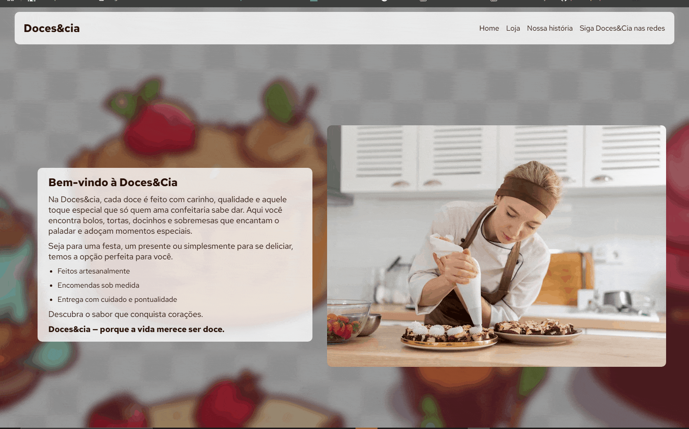

# Projeto Doce&Cia 🍬🍭

Muito contente em finalizar essa landing page do zero, foi muito proveitoso realizá-lo, me ajudou bastante a reforçar meu conhecimento., o objetivo desse projeto foi testar minhas habilidades principalmente em JavaScript, e foi muito proveitoso realizar me ajudou muito a reforçar meu conhecimento, porque foi a parte que demorei mais a fazer, o html e css foi bem tranquilo.

## 🛍️ Descrição do projeto

Este projeto é uma loja de sobremesas com funcionalidade de carrinho de compras, desenvolvido utilizando HTML, CSS e JavaScript puro. O usuário pode adicionar itens ao carrinho, atualizar quantidades, remover produtos e finalizar a compra. O estado do carrinho é salvo no localStorage. O site é responsivo e se adapta bem a diferentes tamanhos de tela.

## 🚀 Funcionalidades 

✅ Adicionar itens ao carrinho

✅ Atualizar a quantidade de produtos

✅ Remover itens individualmente

✅ Mostrar o total da compra

✅ Finalizar a compra (limpa o carrinho)

## 🛠️ Tecnologias Utilizadas

- HTML 
- CSS
- JavaScript (Puro)
- LocalStorage

#  💻 Sequencia de como executar o projeto

## Clone o repositório 

git clone https://github.com/Tiago-SilvaRP/e-comerce-doces.git

## Acesse a pasta do projeto
abra o arquivo index.html no seu navegador 
(se tiver a extensão 'live server' use o atalho alt + l + o para rodar o projeto)

## Navegue até a pasta do repositório 

https://github.com/Tiago-SilvaRP/e-comerce-doces

## Demonstração da seção da loja

[]

## 🔗 Link do repositório

https://github.com/Tiago-SilvaRP/e-comerce-doces

## 🔗 Link do projeto no GitHub Pages

https://tiago-silvarp.github.io/e-comerce-doces/